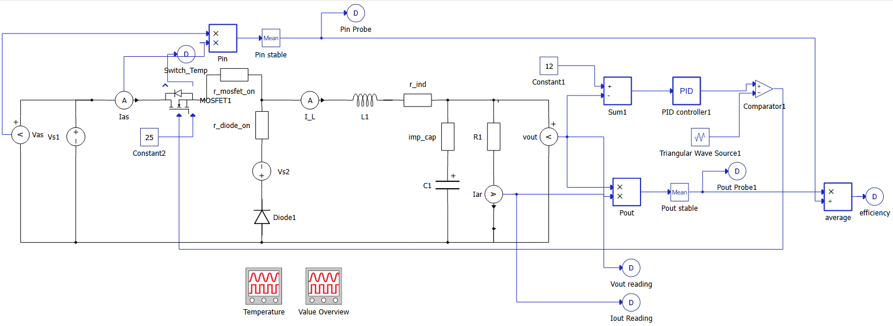
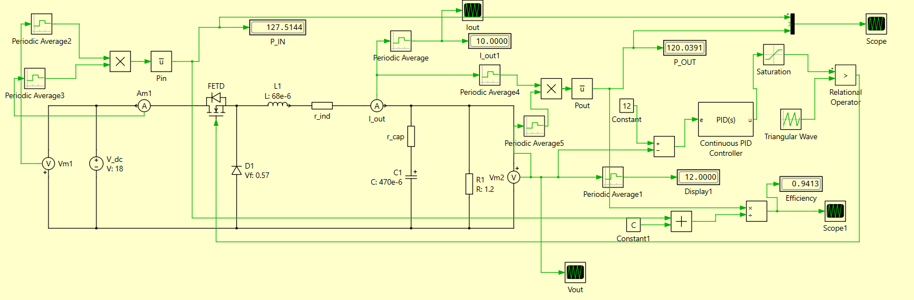
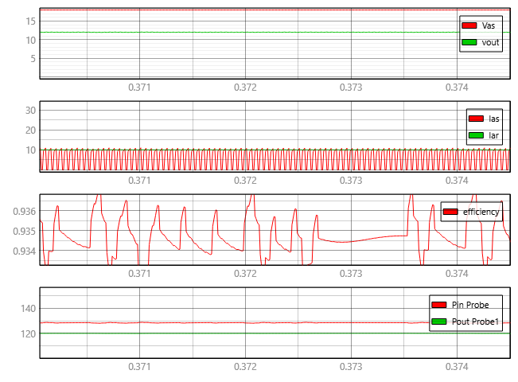
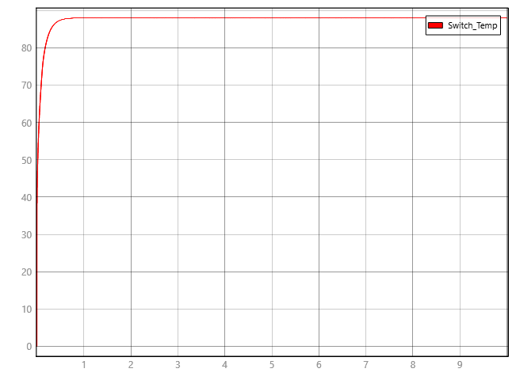
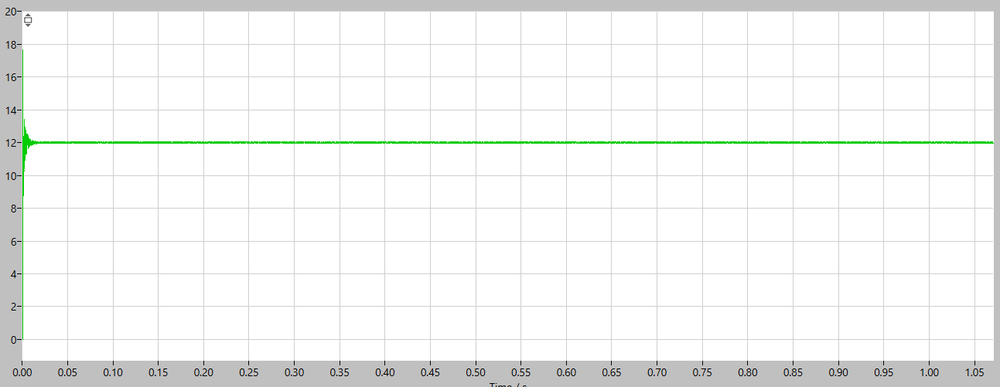

# Buck Converter in TyphoonSim and PLECS

This project presents the design, simulation, and validation of a DC–DC buck converter using
PLECS and TyphoonSim, with closed-loop control and electro-thermal modeling.

The system was developed as part of an assignment for UCSI's BEE3073 Power Electronics Course. Components used in the simulations were based on real-life electronic component datasheets.

---

## System Specifications

- Input Voltage: 18 V  
- Output Voltage: 12 V  
- Output Current: 10 A  
- Switching Frequency: 20 kHz  
- Switching Device: MOSFET  
- Control Method: PID Closed-Loop Control  

---

## System Overview

The buck converter was first modeled in **PLECS** to validate electrical behavior, control stability,
and dynamic response without thermal analysis.

The same converter was then recreated in **TyphoonSim**, where electro-thermal network modeling
was introduced to analyze device losses and temperature rise under operating conditions.

Electrical results showed:
- ~94% accuracy in PLECS (electrical model)
- ~93.15% accuracy in TyphoonSim (electrical + electro-thermal model)

The difference in accuracy reflects the inclusion of thermal effects and loss modeling.

---

## Control Strategy

A PID controller was implemented to regulate the output voltage under load variations.

The controller parameters were tuned to ensure:
- Stable voltage regulation
- Minimal overshoot
- Fast settling time

Values for Kp and Ki were found through trial and error.

---

## Thermal Modeling

Electro-thermal network modeling was implemented exclusively in **TyphoonSim** to estimate:
- Semiconductor conduction and switching losses
- Thermal coupling between components
- Steady-state temperature rise under load

Simulation results confirmed that the converter reaches a stable thermal equilibrium with
component temperatures remaining within safe operating limits.

---

## 📊 Results

Key results include:
- Stable 12 V output at 10 A load
- Consistent switching behavior at 20 kHz
- Reliable closed-loop response to load changes
- Steady-state thermal equilibrium at acceptable temperature levels

Representative waveforms and thermal plots are included in the `/results` directory or below ↓.

---

## 🛠️ Tools & Technologies

- PLECS  
- TyphoonSim  
- Power Electronics Modeling  
- Control Systems (PID)  
- Electro-Thermal Network Simulation  

---

## Author

Eyad Mohamed - Mechatronics Engineering Undergraduate
UCSI University
[LinkedIn](https://www.linkedin.com/in/eyad-mohamed-363b07238/)
